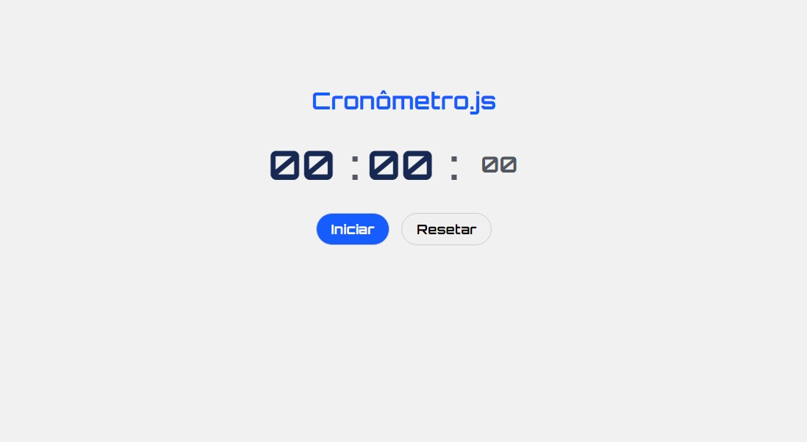

## 🖥️ Projeto

Esse é um projeto Web de um Cronômetro.

## 🚀 Tecnologia

Esse projeto foi desenvolvido durante o NLW da Rocketseat com as seguintes tecnologias:

- HTML
- CSS
- JavaScript
- GIT e Github